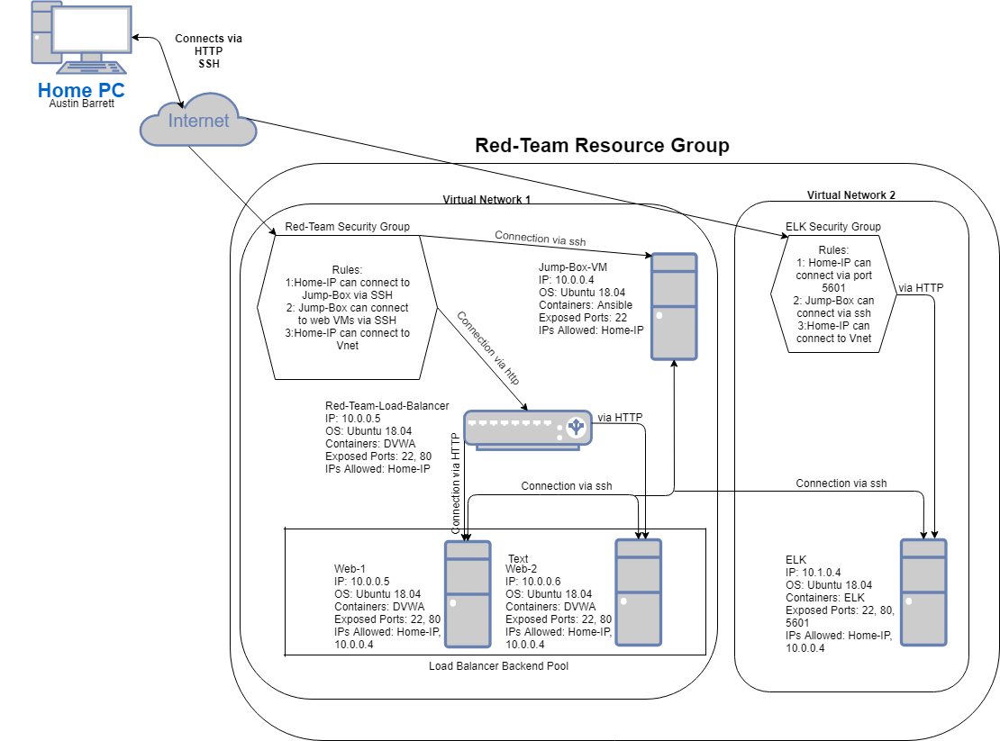

## Automated ELK Stack Deployment

The files in this repository were used to configure the network depicted below.

These files have been tested and used to generate a live ELK deployment on Azure. They can be used to either recreate the entire deployment pictured above. Alternatively, select portions of the YAML file may be used to install only certain pieces of it, such as Filebeat.

  - [ELK Installation](https://github.com/AustinBarrett2282/Elk_Stack_Deployment/blob/main/Ansible/install-elk.yml)
  - [Filebeat & Metricbeat Instllation](https://github.com/AustinBarrett2282/Elk_Stack_Deployment/blob/main/Ansible/filebeat-metricbeat-playbook.yml)

This document contains the following details:
- Description of the Topologies 
- Access Policies
- ELK Configuration
  - Beats in Use
  - Machines Being Monitored
- How to Use the Ansible Build

### Description of the Topology

The main purpose of this network is to expose a load-balanced and monitored instance of DVWA, the D*mn Vulnerable Web Application.

Load balancing ensures that the application will be highly available, in addition to restricting access to the network. Load balancers protect the availability of IT infrastructure by smartly distributing traffic between servers. Jump-Boxes allow for easy configuration and administration of any number of systems.

Integrating an ELK server allows users to easily monitor the vulnerable VMs for changes to the logs and system metrics.
- Filebeat watches for logs to send to Elasticsearch or Logstash
- Metricbeat collects system metrics and sends them to a specified output such as Logstash or Elasticsearch

The configuration details of each machine may be found below.

| Name      | Function  | IP Address | Operating System    |
|-----------|-----------|------------|---------------------|
| Jump Box  | Gateway   | 10.0.0.4   | Linux (Ubuntu 18.04)|
| Web 1     | Server    | 10.0.0.5   | Linux (Ubuntu 18.04)|
| Web 2     | Server    | 10.0.0.6   | Linux (Ubuntu 18.04)|
| ELK Server| Log Server| 10.1.0.4   | Linux (Ubuntu 18.04)|
### Access Policies

The machines on the internal network are not exposed to the public Internet. 

Only the Jump-Box machine can accept connections from the Internet. Access to this machine is only allowed from the following IP addresses:
- My personal home IP

Machines within the network can only be accessed by the Jump-Box
- The Jump-Box machine was also the machine used to access the ELK server at IP: 10.1.0.4

A summary of the access policies in place can be found in the table below.

| Name         | Publicly Accessible | Allowed IP Addresses |
|--------------|---------------------|----------------------|
| Jump Box     | Yes                 | Home IP              |
| Load Balancer| Yes                 | Open                 |
| Web 1        | No                  | 10.0.0.5             |
| Web 2        | No                  | 10.0.0.6             |
| ELK          | Yes                 | Home IP              |
### Elk Configuration

Ansible was used to automate configuration of the ELK machine. No configuration was performed manually, which is advantageous because if a company has a large IT infrastructure it can be a tough responsibility for one person or even a small team of people to be in charge of constantly configuring all the workstations. This old method is repetitive and prone to mistakes. Automated configuration with Ansible is scaleable and playbooks can be updated to accommodate any need.

The playbook implements the following tasks:
- Installs Docker.io, pip3, and the Docker Modulue

- Uses sysctl to increase virtual memory

- Downloads and launchers the ELK Docker Container

The following screenshot displays the result of running `docker ps` after successfully configuring the ELK instance.

### Target Machines & Beats
This ELK server is configured to monitor the following machines:
- Web 1 (10.0.0.5)
- Web 2 (10.0.0.6)

We have installed the following Beats on these machines:
- Filebeat
- Metricbeat

These Beats allow us to collect the following information from each machine:
- Filebeat allows us to collect logs from specific log directiores and then forward them to Elasticsearch or Logstash. Any database log would be an example of this
- Metricbeat collects system information and metrics and also sends then on to a desired output, an example of Metricbeat metrics would be RAM usage 

### Using the Playbook
In order to use the playbook, you will need to have an Ansible control node already configured. Assuming you have such a control node provisioned: 

SSH into the control node and follow the steps below:
- Copy the ansible config file to the ELK VM
- Update the /etc/ansible/hosts file to include the IPs of the webservers and the ELK server
- Run the playbook, and navigate to http://ELK.VM.PUB.IP:5601/app/kibana to check that the installation worked as expected.

- The playbook file is called install-elk.yml, it should be copied to /etc/ansible/install-elk.yml
- The file that gets updated to tell Ansible which machines to run a playbook on is called ansible.cfg. To specify where you want it to install you must create groups in the cfg file and put the IP of the system you want the playbook run on in the corresponding group, and you must also name the group in the playbook YAML file.
- Navigate to http://ELK.VM.PUB.IP:5601/app/kibana to check to see that ELK is running.
